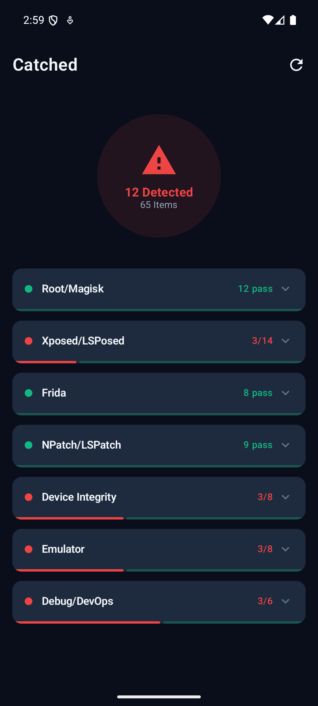

# Catched

An Android security detection toolkit that identifies Root, Xposed, Frida, and LSPatch/NPatch environments through multi-layered analysis combining Java reflection and raw SVC syscalls.

## Screenshot

<p align="center">
  
</p>

## Features

- **Broad Coverage**: Identifies Root, Magisk, Xposed, LSPosed, Frida, and Repackaging (NPatch/LSPatch) environments across 40+ granular checks.
- **Syscall Level Analysis**: Utilizes inline assembly SVC (Supervisor Call) instructions to bypass standard libc wrappers, rendering detections resistant to GOT/PLT hooking and LD_PRELOAD techniques.
- **Hybrid Inspection**: Combines Java-layer reflection, classloader analysis, and stack trace validation with native-layer memory, process, filesystem, and network stream scanning.
- **Evidence Collection**: Captures precise indicators such as hooking stack traces, abnormal memory mappings, and modified application metadata.

## Detection Coverage

### Root / Environment Integrity

Identifies su binaries, Magisk-specific mount points, anomalous OverlayFS structures, Unix sockets, and altered SELinux contexts utilizing raw SVC access and property analysis.

### Xposed Framework

Detects traditional Xposed and modern LSPosed implementations by analyzing BaseDexClassLoader instances, method caches, anomalous native method flags, and suspicious libart.so modifications.

### Frida

Locates frida-agent and gadget injections through `/proc/self/maps` scanning, specific TCP port binding probes, D-Bus AUTH handshake verification, and memory feature scanning for anonymous mapped memory.

### App Repackaging (NPatch/LSPatch)

Uncovers modified ApplicationInfo metadata, injected AppComponentFactory entries, anomalous `cache/npatch/` filesystem structures, and the presence of `libnpatch` shared objects in the process space.

## Architecture

```
cn.fatalc.catched/
├── model/
│   └── Check.kt              # Check (id, group, name, desc, tags, run) + CheckResult
├── engine/
│   └── DetectorEngine.kt     # Registry + scheduler, per-check callback
├── detector/
│   ├── RootChecks.kt          # fun rootChecks(ctx): List<Check>
│   ├── XposedChecks.kt        # fun xposedChecks(ctx): List<Check>
│   ├── FridaChecks.kt         # fun fridaChecks(): List<Check>
│   └── NPatchChecks.kt        # fun npatchChecks(ctx): List<Check>
├── native/
│   └── NativeBridge.kt        # JNI declarations
└── cpp/
    ├── catched.c              # JNI dynamic registration
    ├── root_detect.c/h        # Root/Magisk native detection
    ├── frida_detect.c/h       # Frida native detection
    ├── hook_detect.c/h        # Xposed/Hook native detection
    ├── npatch_detect.c/h      # NPatch native detection
    ├── maps_scanner.c/h       # /proc/self/maps parser
    ├── syscall_wrapper.c/h    # SVC direct syscall wrappers
    └── art_method.c/h         # ArtMethod struct analysis
```

### Design Principles

**Registration-first** — Each check is a self-contained `Check` object with metadata and a `run` lambda. The engine collects them and schedules execution. Adding a new check = one function call.

```kotlin
Check("fr.maps", "Frida", "maps SO scan", "...", setOf("native", "svc")) {
    CheckResult(NativeBridge.nDetectFridaMaps())
}
```

**Groups are labels, not executors** — Groups exist only for UI categorization. The engine runs checks individually.

**Tag-based filtering** — Each check carries semantic tags (`native`, `svc`, `java`, `reflection`, `procfs`, etc.). Supports scanning by specific check IDs.

**SVC syscall bypass** — Native checks use inline assembly SVC instructions instead of libc wrappers, making them resistant to LD_PRELOAD / GOT hooking.

## Documentation

Detailed documentation on supported frameworks and detection techniques, see [docs](docs/).

## Build

```bash
# Debug build
./gradlew assembleDebug

# Install to connected device
adb install -r app/build/outputs/apk/debug/app-debug.apk
```

**Requirements:**

- Android Studio with NDK installed
- Min SDK 26 (Android 8.0)
- Target SDK 36
- ABI: arm64-v8a, armeabi-v7a

## License

MIT
